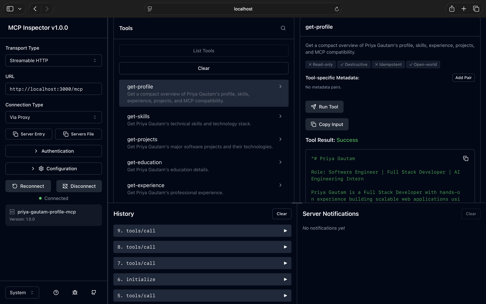
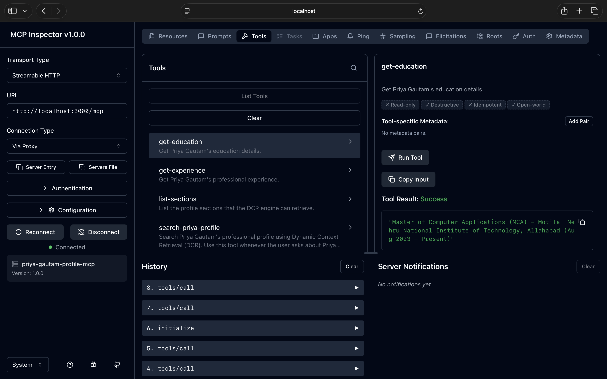
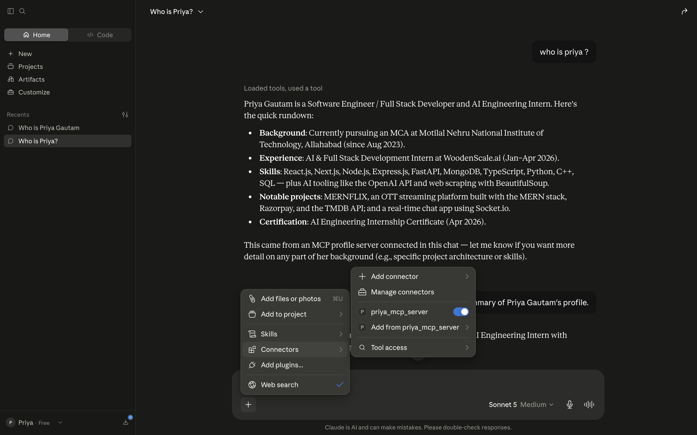
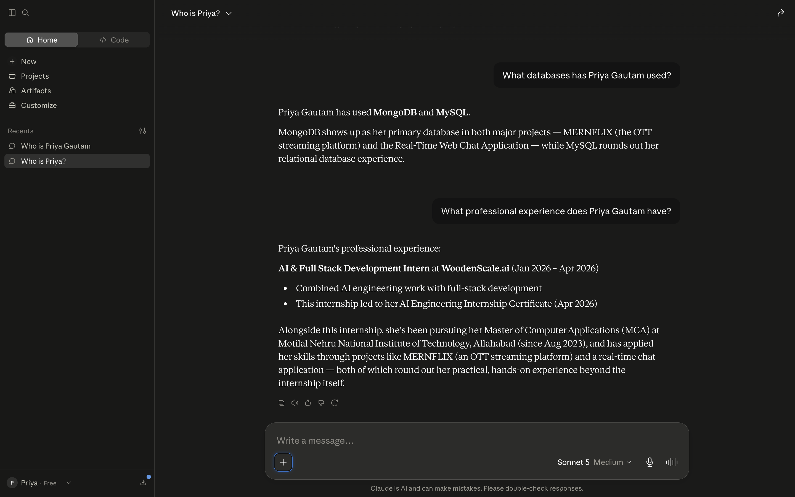

# Priya Gautam MCP Server

An MCP (Model Context Protocol) server that exposes Priya Gautam's professional profile through tools, resources, prompts, and Dynamic Context Retrieval (DCR).

## Screenshots

### Profile



### Education



### About Priya





## Source vs compiled code

- `src/*.ts` = editable TypeScript source code.
- `dist/*.js` = compiled JavaScript generated from the TypeScript source.
- `dist` is included in this ZIP so Node/Claude can run the server immediately after dependencies are installed.
- Do not edit files inside `dist` manually. Change `src/*.ts` and run `npm run build` again.

## Requirements

- Node.js 20+
- npm

## Install

```bash
npm install
```

## Verify TypeScript

```bash
npm run check
```

## Build TypeScript -> JavaScript

```bash
npm run build
```

This generates:

```text
dist/
├── dcr.js
├── index.js
├── profile.js
└── server.js
```

## Run locally in STDIO mode

This is the recommended mode for local Claude Desktop / IDE MCP clients.

```bash
npm start
```

`npm start` runs `node dist/index.js`.

### Claude Desktop configuration

Use the example in `claude_desktop_config.example.json` and replace the placeholder with the absolute path to this project's `dist/index.js`:

```json
{
  "mcpServers": {
    "priya-gautam-mcp": {
      "command": "node",
      "args": [
        "/ABSOLUTE/PATH/TO/MOJO/dist/index.js"
      ],
      "env": {}
    }
  }
}
```

Do not point `node` directly at `src/index.ts`. Node runs the compiled `dist/index.js`.

## Development mode

For development only:

```bash
npm run dev
```

This uses `tsx watch src/index.ts`.

## HTTP mode

Run:

```bash
MCP_TRANSPORT=http npm run dev
```

The server exposes:

```text
http://localhost:3000/health
http://localhost:3000/mcp
```

The `/health` endpoint is for a simple browser check. `/mcp` is an MCP protocol endpoint and should be tested using an MCP client or MCP Inspector, not by opening it as a normal webpage.

## MCP tools

- `get-profile`
- `get-skills`
- `get-projects`
- `get-education`
- `get-experience`
- `list-sections`
- `search-priya-profile` — primary DCR tool
- `search-profile` — backward-compatible alias
- `explain-dcr`

## DCR

`search-priya-profile` ranks profile sections against the user's question and returns the most relevant context instead of returning the complete profile every time.

Example questions:

- What are Priya's technical skills?
- Tell me about Priya's WoodenScale experience.
- What projects has Priya built?
- What is Priya's educational background?

## Important

Do not run `npm run dev` as the Claude Desktop production/local MCP command. Use `npm start`, which runs the compiled JavaScript entry point.
